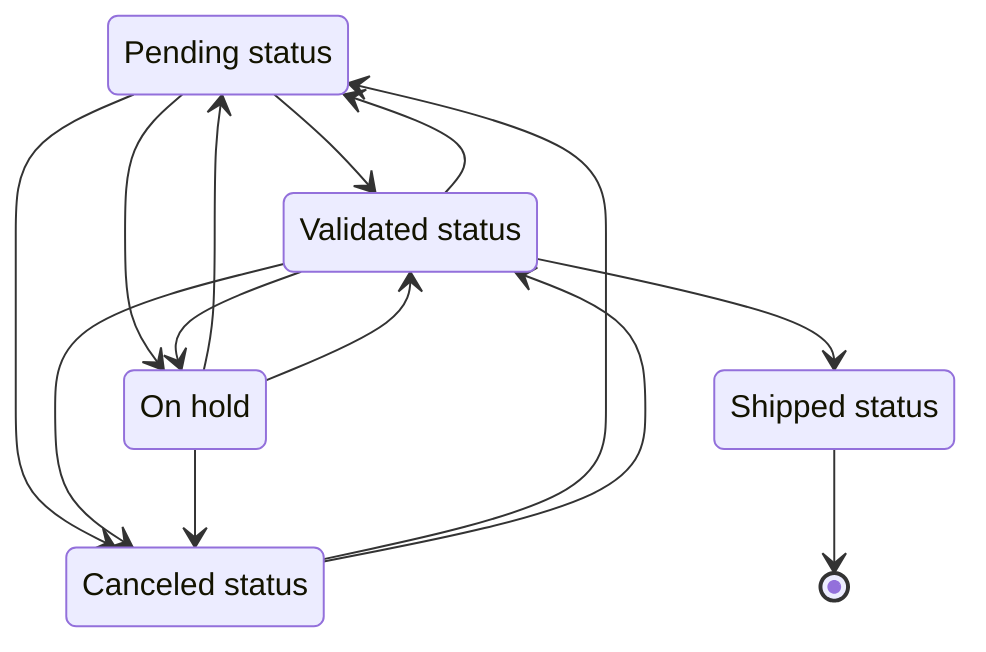

<!--
 ___ _            _ _    _ _    __
/ __(_)_ __  _ __| (_)__(_) |_ /_/
\__ \ | '  \| '_ \ | / _| |  _/ -_)
|___/_|_|_|_| .__/_|_\__|_|\__\___|
            |_| 
-->

* * *

`DemoDashboard` module definition
=================================

**Depends on**: Demo

Introduction
------------

This module contains a custom dashboard for the demo **order management** application.:

### Prerequisites

The `Demo` module **must** be installed and configured before importing this addon module.

Import
------

To import this module:

- Create a module named `DemoDashboard`
- Set the settings as:

```json
{
	"type": "git",
	"branch": "v6",
	"origin": { "uri": "https://github.com/simplicitesoftware/module-demo-dashboard.git" }
}
```

- Click on the _Import module_ button

`DemoStats1` (Statistics per statuses) business object definition
-----------------------------------------------------------------

Statistics per statuses

**Physical table**: `select`

### Fields

| Name                                                         | Type                                     | Column                         | Required | Updatable | Personal | Description                                                                      |
|--------------------------------------------------------------|------------------------------------------|--------------------------------|----------|-----------|----------|----------------------------------------------------------------------------------|
| `demoOrdStatus`                                              | enum(30) using DEMO_ORD_STATUS list      | ord_status                     | yes      | yes       |          | Order status                                                                     |
| `demoStsCount`                                               | int(10)                                  | sts_count                      |          | yes       |          | -                                                                                |
| `demoStsQuantities`                                          | int(10)                                  | sts_quantities                 |          | yes       |          | Ordered quantities                                                               |
| `demoStsTotals`                                              | float(10, 2)                             | sts_totals                     |          | yes       |          | Ordered amount                                                                   |

### Enumerations

* `DEMO_ORD_STATUS`
    - `P` Pending status
    - `H` On hold
    - `V` Validated status
    - `D` Shipped status
    - `C` Canceled status

### State transitions (`demoOrdStatus`)



### Description (from code)

> Statistics per statuses

### Implemented hooks

* `postLoad`

`DemoStats2` (Statistics per product) business object definition
----------------------------------------------------------------

Stats per products

**Physical table**: `select`

### Relationships

* Belongs to **DemoProduct** via `demoStsRowId` (optional)

### Fields

| Name                                                         | Type                                     | Column                         | Required | Updatable | Personal | Description                                                                      |
|--------------------------------------------------------------|------------------------------------------|--------------------------------|----------|-----------|----------|----------------------------------------------------------------------------------|
| **`demoStsRowId`** link to **`DemoProduct`**                 | id                                       | row_id                         |          | yes       |          | -                                                                                |
| _`demoPrdReference`_                                         | _regexp(10)_                             | _prd_code_                     |          |           |          | _Product reference_                                                              |
| _`demoPrdName`_                                              | _char(100)_                              | _prd_name_                     |          |           |          | _Product name_                                                                   |
| _`demoPrdType`_                                              | _enum(50) using DEMO_PRD_TYPE list_      | _prd_type_                     |          |           |          | _Product type_                                                                   |
| _`demoPrdAvailable`_                                         | _boolean_                                | _prd_available_                |          |           |          | _Available product?_                                                             |
| _`demoPrdStock`_                                             | _int(11)_                                | _prd_stock_                    |          |           |          | _Current stock for product_                                                      |
| `demoStsCount`                                               | int(10)                                  | sts_count                      |          | yes       |          | -                                                                                |
| `demoStsQuantities`                                          | int(10)                                  | sts_quantities                 |          | yes       |          | Ordered quantities                                                               |
| `demoStsTotals`                                              | float(10, 2)                             | sts_totals                     |          | yes       |          | Ordered amount                                                                   |

### Custom actions

* `DEMO_STS2_AVAILABLE`: 
* `DEMO_STS2_NOT_AVAILABLE`: 

### Description (from code)

> Product statistics & availability monitoring

### Implemented hooks

* `available`: Action: Make product available
* `isActionEnable`
* `notAvailable`: Action: Make product not available

External objects
----------------

* `DemoDashboard`: Demo dashboard (using Google charts)

